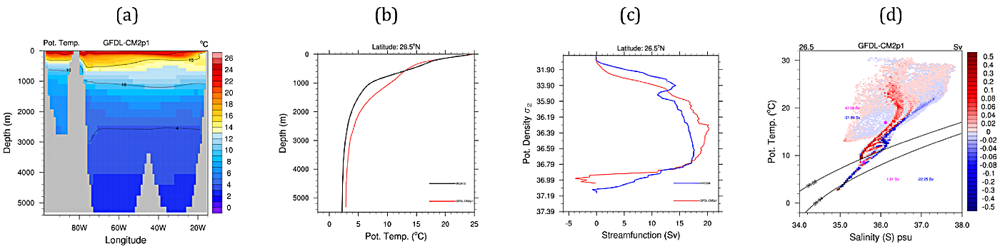
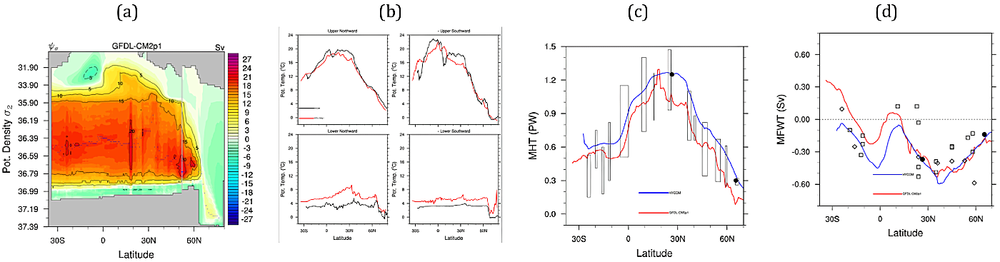
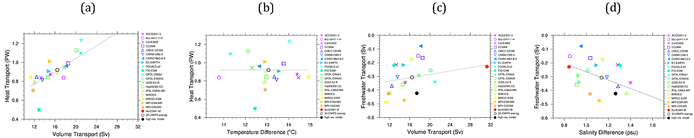

AMOC 3D Structure Diagnostic Package
====================================

Last updated: 02/25/2019

The AMOC 3D structure diagnostic package evaluates the AMOC represented in theCMIP5 models and compares with the results of observations and a high-resolution ocean simulation. The basic statistics include the traditional meridional overturning streamfunction on depth and density coordinates as well as the meridional volume transport projected on potential temperature/salinity space (i.e., transport on TS), a natural way of characterizing the water mass. The structure of the meridional heat and freshwater transports can also be derived by integrating the transport on TS along isotherms and isohalines, respectively. Finally, the water property characteristics of upper and lower limbs of the AMOC are defined in terms of transport-weighted temperature and salinity.

Version & Contact information
-----------------------------

Version 1.3 (09-May-2018)

- PI and POC: Xiaobiao Xu (COAPS/Florida State University, xxu3@fsu.edu)
- Developers: Fuchang Wang (now at Shanghai JiaoTong University, China, fcwang@sjtu.edu.cn) and Xiaobiao Xu (COAPS/Florida State University, xxu3@fsu.edu)

Open source copyright agreement
^^^^^^^^^^^^^^^^^^^^^^^^^^^^^^^

This package is distributed under the LGPLv3 license (see LICENSE.txt).

Functionality
-------------

The currently package consists of the following functionalities:

1. AMOC on depth coordinate (*AMOC_T2B_from_climate.py*)
2. Meridional volume transport projected on T-S plane (*transport_onto_TS.py*)
3. AMOC on temperature, salinity, and density coordinates (*AMOC_qts_from_yearly.py*)
4. Transport-weighted temperature and salinity (*trans_wgt_TS_yearly.py*)

| As a module of the MDTF code package, all scripts of this package can be found under “diagnostics/AMOC_3D_Structure”; 
| Pre-processed results from observations and high-resolution ocean simulation are under “inputdata/obs_data/AMOC_3D_Structure”.

Required programming language and libraries
-------------------------------------------

The package is coded in Python2 and uses the Python standard library as well as the CDO utilities. The figures are produced using NCAR Command Language (NCL) scripts; version (6.5.0) is recommended.

Required model input data
-------------------------

The following 4-D (latitude-longitude-level-time) monthly mean model outputs 
are required:

1. Potential temperature (variable **thetao** in °C)
2. Salinity (variable **so** in psu)
3. Meridional velocity (variable **vo** in m s\ :superscript:`-1`\ ) or meridional volume transport (**vmo** in m\ :superscript:`3`\  s\ :superscript:`-1`\ )
4. Thickness of model level is provided (variable **thkcello** in m, 3-D in most models)

References
----------

- Xu, X., P. B. Rhines, & E. P. Chassignet, *J. Clim.* (2016) **29** (21): 7723–7742. https://doi.org/10.1175/JCLI-D-15-0798.1
- Xu, X., E. P. Chassignet, & F. Wang, *Clim. Dyn.* (2018) **52**, 6511–6531. https://doi.org/10.1007/s00382-018-4529-0

See ftp://ftp.coaps.fsu.edu/pub/fwang/wkdir/AMOC_3D_Structure.html for updates.

More about this diagnostic
--------------------------

The current version of the AMOC 3D structure diagnostic package produces three types of figures for CMIP5 model outputs:

1. Basic structure at one latitude (26.5°N),
2. Statistics as a function of latitude, and
3. Collapsed comparison between different models.

Below are some selected figures that are produced by the package using one GFDL-CM2.1 historical simulation, and the model-model comparison on the relationship between heat (and freshwater) transports and AMOC transports or water properties from 20 CMIP5 historical simulations.

1) Basic structure at one latitude
^^^^^^^^^^^^^^^^^^^^^^^^^^^^^^^^^^

   Basic statistics at Atlantic 26.5°N: a) temperature distribution as a function of longitude and depth, (b) temperature profile as a function of depth, (c) overturning streamfunction on density coordinate, (d) meridional volume transport on temperature and salinity plane, Q(T,S). Black line in panel (b) represents profile from WOA2013, blue line in panel (c) results is the high-resolution model while red line in panels (b)-(c) is from CMIP5 model GFDL-CM2.1. The isopycnals in panel (d) indicate the upper and lower interface of the modeled NADW, and the transport-weighted temperature and salinity, pink and blue numbers indicate the northward and southward flows, respectively.

In addition to the traditional AMOC streamfunction calculated on depth coordinate, the meridional volume transport on temperature–salinity plane, or Q(T, S), is useful in illustrating the water mass structure of the AMOC: 1) a summation of the first momentums T\*Q(T, S) and S\*Q(T, S) directly gives the heat and salinity (freshwater) transports; 2) an integration of Q(T,S) along isotherms, isohalines, isopycnals gives AMOC streamfunction as a function of temperature, salinity, and density; and 3) the transport-weighted temperature and salinity of the layered Q(T,S) characterize the T-S properties of the water mass in the upper and lower AMOC limbs.

2) Statistics as a function of latitude
^^^^^^^^^^^^^^^^^^^^^^^^^^^^^^^^^^^^^^^

   Statistics as a function of latitude: (a) AMOC streamfunction on density coordinate, (b) transport-weighted temperature in the upper and lower limb of the AMOC, (c) meridional heat transport, and (d) meridional freshwater transport. The red lines in panels b-d are the results from GFDL-CM2.1, blue lines are from a high-resolution ocean simulation and black markers (rectangles, circles, squares) are observational estimates.

3) Collapsed comparison between different models
^^^^^^^^^^^^^^^^^^^^^^^^^^^^^^^^^^^^^^^^^^^^^^^^

   Relationship between (a) meridional heat transport and volume transport of the AMOC, (b) heat transport and temperature difference between upper and lower limb of the AMOC, (c) meridional freshwater transport and volume transport of the AMOC, (d) freshwater transport and salinity difference between upper and lower AMOC limbs. The colored symbols represent results from CMIP5 models and the black dot indicates the results from a high-resolution ocean simulation. The results show that the smaller temperature difference between upper and lower limbs of the AMOC is largely responsible for the overall weaker heat transport, and the freshwater transport among CMIP5 models is correlated with the salinity difference between the upper and lower AMOC limbs.

